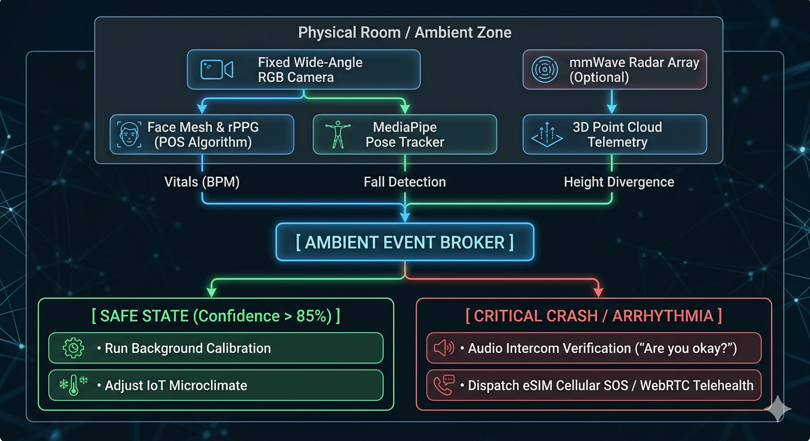

# AURA-Health-Ambient

**"The Invisible Shield: Non-Contact Vitals Tracking and Ambient Fall Prevention for High-Risk Care."**

AURA-Health-Ambient is a next-generation Ambient Intelligence (AmI) system designed to protect elderly individuals, heart patients with pacemakers, and mobility-impaired individuals without requiring them to wear physical sensors, charge smartwatches, or interact with mobile applications.

By merging Non-Contact rPPG (Remote Photoplethysmography), mmWave Radar topologies, and Edge-Native pose estimation, the system transforms physical environments into smart, continuous health-monitoring zones.

---

## 🌟 Core Pillars & Advancements

- **Zero-Contact Monitoring:** No wearables required. Eliminates the risk of patients forgetting to charge or wear emergency devices.
- **Zero Electromagnetic Interference (EMI):** Uses standard RGB cameras and micro-sensors that emit no strong electromagnetic fields, making it 100% safe for individuals with cardiac pacemakers.
- **Privacy-First Processing (Edge AI):** All signal analysis, face stabilization, and kinetic assessments happen locally on hardware (e.g., NVIDIA Jetson Orin). No private data or video feeds are sent to the cloud.
- **Ambient Autonomy:** Features built-in logic placeholders for ROS 2 auto-docking configurations to ensure continuous power management without human assistance.

---

## 🧠 System Architecture Overview




---

## 📂 Repository Layout

```text
aura-health-ambient/
├── config/
│   └── system_config.json      # Camera parameters, ROI anchors, and safety thresholds
├── src/
│   ├── sensors/
│   │   └── radar_receiver.py   # Serial parsing interface for mmWave Radar point clouds
│   ├── vision/
│   │   ├── face_alignment.py   # 2D Affine Transformation face mesh stabilization
│   │   └── rppg_engine.py      # Core POS (Plane-Orthogonal-to-Skin) vitals code
│   ├── navigation/
│   │   └── ros2_autodock.py    # ROS 2 custom subscriber/publisher node for IR dock tracking
│   └── main_hub.py             # Main multithreaded orchestrator and fallback logic
├── requirements.txt            # Python development dependencies
└── README.md                   # Project documentation
```

---

## 🛠️ Technical Stack & Dependencies

- **Core Engine:** Python 3.10+
- **Biomedical & Vision Processing:** MediaPipe (FaceMesh & Pose tracking), OpenCV, SciPy (Signal filters)
- **Robotics Integration:** ROS 2 Humble / Iron (Nav2 Server hooks, Serial IR-beacon decoding)
- **Target Edge Hardware:** NVIDIA Jetson Orin Nano/NX or Rockchip Rock 5B

---

## 🚀 Quick Start & Installation

### 1. Clone and Set Up Environment
```bash
git clone https://github.com
cd aura-health-ambient
```

### 2. Install Required Dependencies
Ensure you have your environment or virtual environment active, then run:
```bash
pip install -r requirements.txt
```

### 3. Run the Core Ambient Monitor
Connect a standard USB webcam or feed an IP camera RTSP stream, then execute:
```bash
python src/main_hub.py
```
*Press **'q'** inside the video interface window to terminate execution safely.*

---

## 🛡️ Algorithmic Noise Cancellation (Against Motion Artifacts)

To combat the massive pixel noise generated when a patient speaks, coughs, or turns their head, the core pipeline implements a **3-Layer Filter Stack**:
1. **Geometric Transformation:** MediaPipe anchors extract rigid facial landmarks (eyes, nose) to generate an active 2D Affine wrap, keeping the region of interest (ROI) static regardless of head rotation.
2. **POS Mapping:** The mathematical POS algorithm separates RGB color shifts into skin-orthogonal planes, cancelling out ambient light reflections and shadows caused by movement.
3. **Bandpass Constraints:** A 3rd-order Butterworth filter blocks signals outside the realistic human cardiac envelope ($0.75\text{Hz}$ to $3.0\text{Hz}$, matching $45$ to $180\text{ BPM}$).

---

## 🩺 Medical Disclaimer

This software architecture and its technical implementations serve exclusively as technological research concepts and structural prototypes. It has not been validated by healthcare authorities, and it is not intended to substitute for clinical-grade hardware diagnostics, professional medical treatment, or definitive automated medical dispatch decisions.
